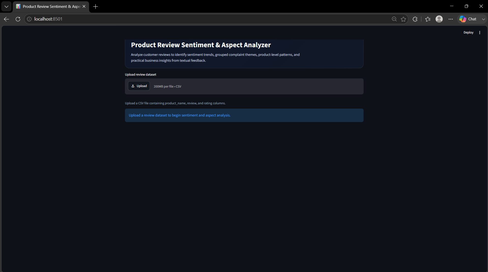
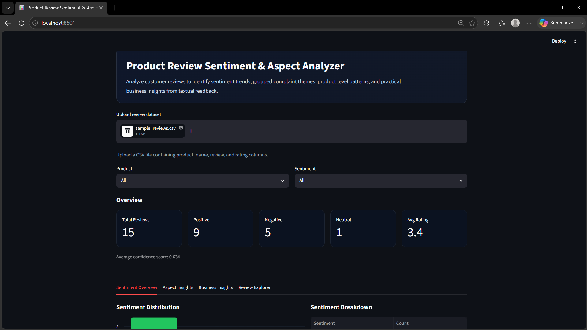
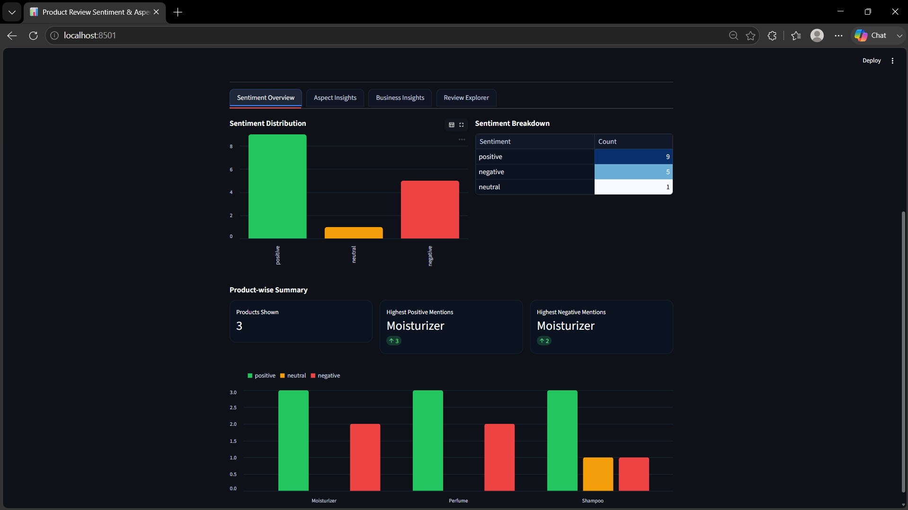
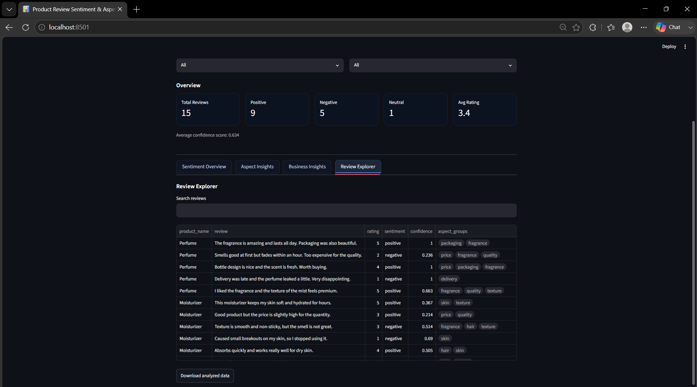

# Product Review Analyzer

An interactive Streamlit dashboard for analyzing customer reviews using Natural Language Processing (NLP). This project helps convert raw review text into useful insights such as sentiment trends, keyword patterns, and product-level review analysis.

## Features

- Upload and analyze product review datasets
- View summary metrics through KPI cards
- Filter reviews by product, rating, sentiment, or other fields
- Explore sentiment patterns and review insights visually
- Inspect individual review text in a review explorer
- Understand customer feedback in a more structured way

## Tech Stack

- Python
- Streamlit
- Pandas
- NumPy
- Matplotlib / Plotly
- Scikit-learn
- NLTK / TextBlob / WordCloud  
  (keep only the libraries you actually used)

## Project Structure

```text
product-review-analyzer/
├── app.py
├── requirements.txt
├── README.md
├── .gitignore
└── assets/
    ├── dashboard-overview.png
    ├── filters-kpis.png
    ├── sentiment-analysis.png
    └── review-explorer.png
```

## Installation

```bash
git clone <your-repository-link>
cd product-review-analyzer
python -m venv venv
source venv/bin/activate
pip install -r requirements.txt
streamlit run app.py
```

For Windows:

```bash
venv\\Scripts\\activate
```

## Usage

1. Run the Streamlit app.
2. Upload the review dataset.
3. Apply filters based on product, rating, or sentiment.
4. Explore KPI cards, charts, and tabs.
5. Open the review explorer for detailed review analysis.

## Screenshots

### Dashboard Overview


### Filters and KPI Cards


### Sentiment Analysis


### Review Explorer


## Problem Statement

Customer reviews contain valuable information, but raw text is difficult to analyze manually at scale. This project solves that problem by transforming review data into an interactive dashboard that helps users understand customer sentiment and feedback patterns more efficiently.

## Future Improvements

- Add aspect-based sentiment analysis
- Add model comparison for sentiment classification
- Add downloadable reports for filtered results
- Deploy the project online for live use

## License

MIT License

## Author

Your Name  
[GitHub Profile](https://github.com/your-github-username)